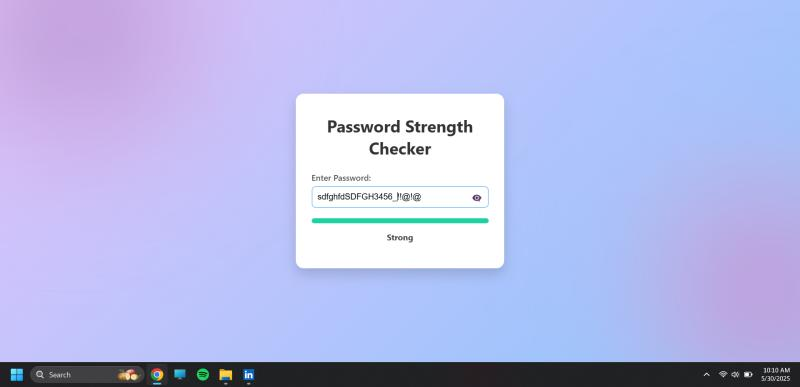
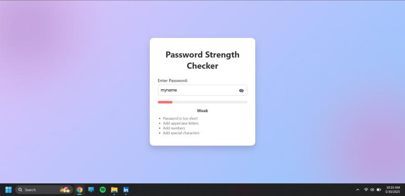

# 🔐 Password Strength Tester

Developed a password strength tester tool while exploring fundamental cybersecurity concepts. This project evaluates the strength of a given password based on complexity, uniqueness, and overall integrity.

## 💡 Features

- Checks for password length and character variety  
- Flags use of common or weak passwords  
- Suggests improvements for stronger password creation  
- Simple and intuitive user interface  
- Password visibility toggle for better UX  
- Real-time strength meter with color-coded feedback

## 🛠️ Tech Stack

- **Frontend**: HTML, CSS, JavaScript  
- **Backend**: Python  
- **Libraries**: `re`, `string`, `flask` 
- **Tools**: VS Code, Git, GitHub

## 📸 UI Preview


<br><br>


## 🚀 How to Run

1. Clone the repository  
   ```bash
   git clone https://github.com/fragan7dsouza/password-strength-tester.git
   ```

2. Run the Python backend script (for CLI or optional Flask app)  
   ```bash
   python app.py
   ```

3. To use the frontend UI, open `index.html` directly in your browser  
   (You can also connect it with the backend if using Flask)

## 📄 License

MIT License
